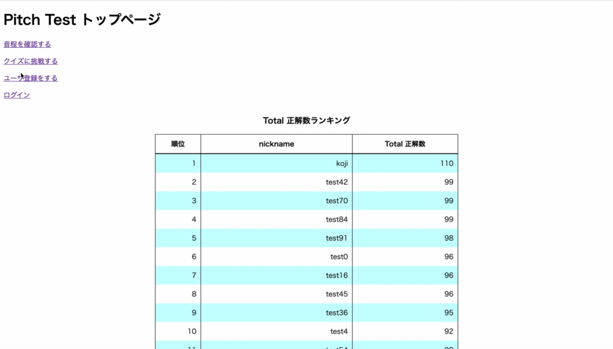
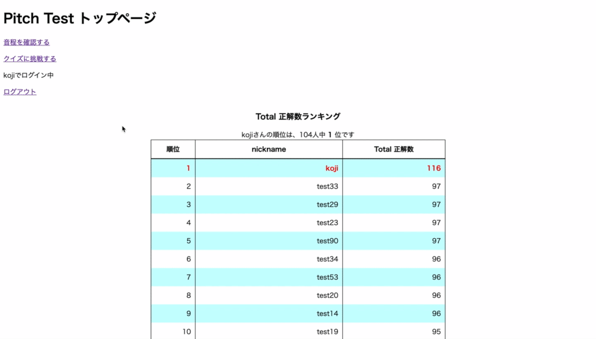
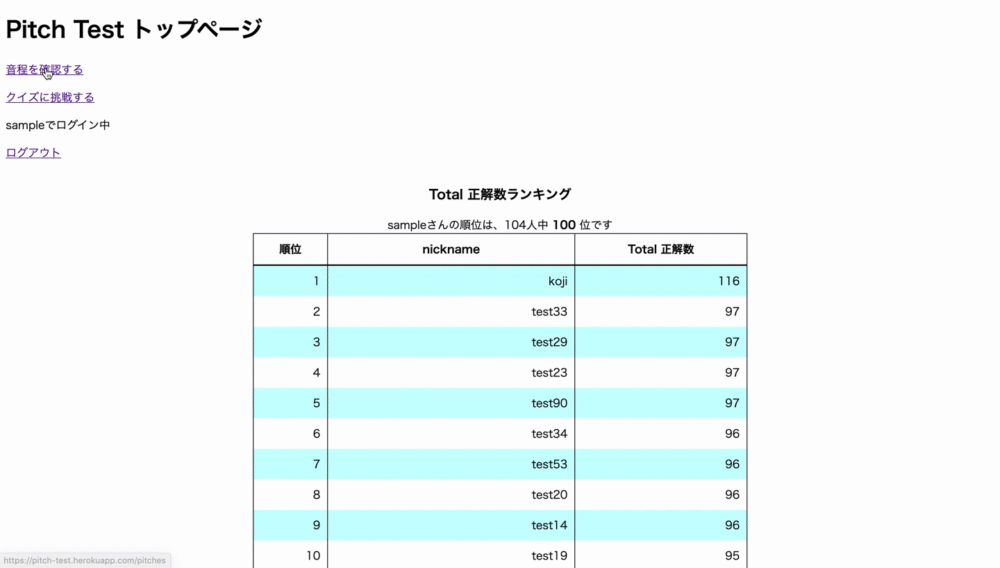
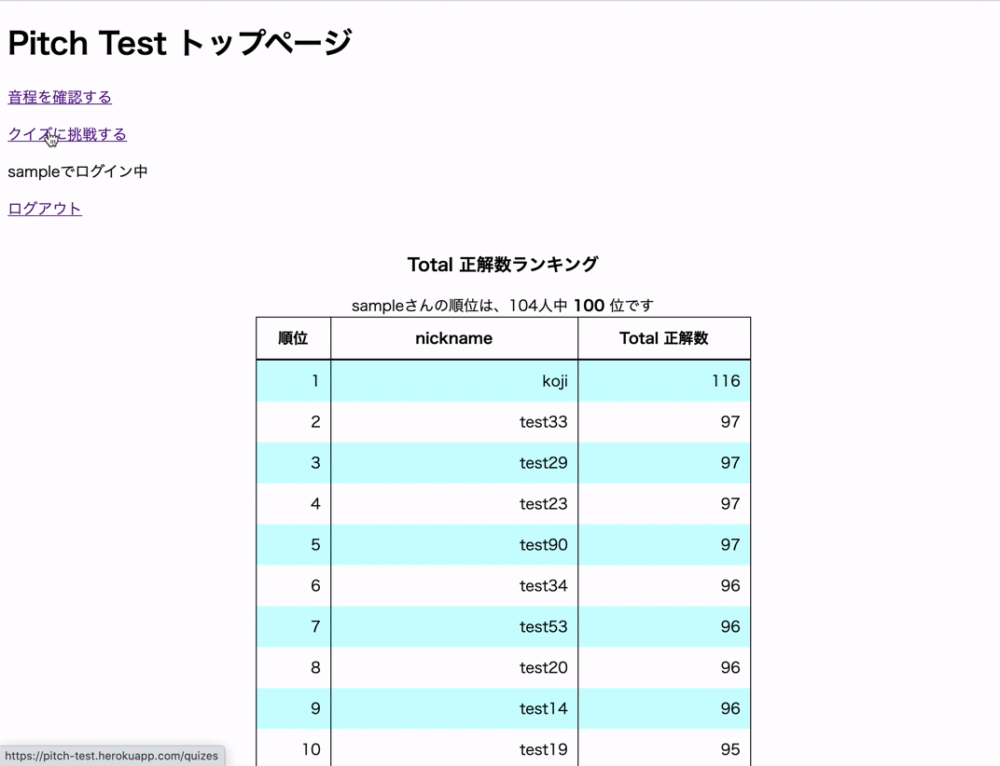

# Pitch_test

**＊＊注意：このアプリでは音がでます＊＊**<br>
音程当てクイズに挑戦することができます。<br>
また、音当てクイズに挑戦する前に、音程の確認をすることもできます。<br>
ユーザ登録をすることで、正解数、正答率、正解までにかかった時間の平均が記録され、ランキングに参加することができます。<br>
ランキングは全6種類です。<br>
正解数、正答率、正解までにかかった時間の平均ごとにランキングがあり、それぞれの項目に対し、累計値のランキングと今日のランキングが存在します。<br>

# URL

https://pitch-test.herokuapp.com/

# テスト用アカウント

ニックネーム：sample<br>
パスワード：123456<br>

# 目指した課題解決

「メロディを聴いただけで、楽器で再現ができるようになりたい」、「音名を言われた時に、すぐにその音を歌えるようになりたい」といった、音感を身に付けたい方を対象にこのアプリを開発しました。<br>
また、音感は一朝一夕では身に付けられません。日々のモチベーションを維持するために、ランキング機能を実装しました。<br>
今までの努力を可視化するために、累計値のランキングを、日課にすることができるように、今日のランキングを実装しています。<br>

# 洗い出した要件

|機能|目的|詳細|
|---|---|---|
|音程確認機能|ユーザが正しいピッチを知ることができるようにするため。|音を指定することで、マイクから指定された音を出力する。<br>音の指定方法は、ボタンにする。<br>現在は1オクターブを実装。実装はtone.jsを使用。|
|クイズ機能|ランダムで出力された音の音名を考えることで、音感を鍛えるため|ランダムで出力された音がどの音かをボタンで指定する。<br>解答に合わせて、正誤の表示とチャイムを鳴らす。|
|ユーザ登録機能|ユーザごとにクイズのスコアを記録するため。|トップページからユーザ登録をできるようにする。<br>登録済みのユーザは、クイズ時に、正答率を記録する。<br>登録するのは、ユーザ名とパスワードのみ。|
|スコア管理機能|ユーザごとのクイズのスコアを記録するため。|クイズをするたびに、正解数・誤答数・正答率・累計時間・正解までにかかった時間の平均を更新する。<br>また、ユーザ登録からの累計と、日毎のデータの2種類を保存・表示する。|
|ランキング機能|ユーザ全体の記録を確認するため|トップページで正解数、正答率、正解までにかかった時間の平均に関するランキングを見ることができる。<br>ユーザ登録から今までの累計のランキング、その日のランキングを表示する。|

# 利用方法

### ユーザ登録
トップページの「ユーザ登録をする」から、ユーザ登録をすることができます。<br>
登録しなくてもアプリは使用できます。<br>
正答率などのスコアを保存したい場合は、ユーザ登録をおこなってください。<br>
<br>

### ログイン
トップページの「ログイン」から、ログインをすることができます。<br>
ログインに成功すると、トップページにあなたのニックネームが表示されます。<br>
**＊＊注意：現状、パスワードの再発行機能はありません。忘れないようにご注意ください。＊＊**<br>
<br>

### ランキングの確認
トップページから各種ランキングを確認することができます。<br>
ログインしている場合は、あなたの順位が赤字で表示されます。<br>


### 音程の確認
トップページの「音程を確認」するから音程確認ページに移動できます。<br>
音名の書いてあるボタンを押すことで、その音を鳴らすことができます。<br>
<br>

### クイズ
トップページの「クイズに挑戦する」するからクイズページに移動できます。<br>
push!ボタンを押すことで、ランダムで音がなり、選択肢のボタンが表示されます。<br>
同時に、タイマーがスタートします。<br>
hear again!ボタンを押すことで、もう一度音を鳴らすことができます。<br>
間違えた場合は、ブザー音がなります。<br>
正解するまで、何度でもボタンを選択することができます。<br>
正しい音のボタンを押すと、正解音がなり、選択肢のボタンが非表示になります。<br>
同時に、タイマーもストップします。<br>
再度、クイズに挑戦する場合は、もう一度push!ボタンを押してください。<br>
**＊＊注意：記録の更新は、選択肢のボタンを押したタイミングで実行されます＊＊**<br>
<br>

# 今後の予定

- 音色の追加
- 音域の追加
- 基準周波数の変更機能の追加
- viewの編集
- ユーザごとのProgressChart表示機能の追加

# テーブル設計

## usersテーブル

|Column|Type|Options|
|---|---|---|
|nickname|string|null: false, unique: true|
|password|string|null: false|
|password_confirmation|string|null: false|

### アソシエーション

- has_one :total_score
- has_many :daily_score

## total_scoresテーブル

|Column|Type|Options|
|---|---|---|
|user|references|null: false, foreign_key: true, index: {unique: true}|
|total_correct_count|integer|null: false|
|total_wrong_count|integer|null: false|
|total_correct_rate|integer|null: false|
|total_time|float|null: false|
|total_average_time|float|null: false|

### アソシエーション

- belongs_to :user

### アソシエーション

- has_one :total_score
- has_many :daily_score

## daily_scoresテーブル

|Column|Type|Options|
|---|---|---|
|user|references|null: false, foreign_key: true|
|daily_correct_count|integer|null: false|
|daily_wrong_count|integer|null: false|
|daily_correct_rate|integer|null: false|
|daily_time|float|null: false|
|daily_average_time|float|null: false|

### アソシエーション

- belongs_to :user

# ローカルでの動作方法

## 環境

ruby 2.6.6<br>
rails 6.0.3.3<br>

## 使用したJavaScriptライブラリ

Tone.js

## コマンド

```
git clone https://github.com/mark0802-prog/pitch_test.git
cd pitch_test
bundle install
yarn install
rails db:create
rails db:migrate
rails s
```
http://localhost:3000 にアクセス<br>

### 補足

- Tone.jsのダウンロードは、以下のコマンドで実施できます。<br>
`npm install tone`

- Tone.jsのurl<br>
https://tonejs.github.io/<br>
